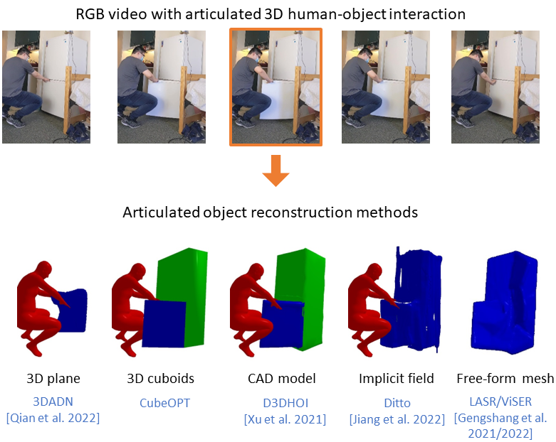
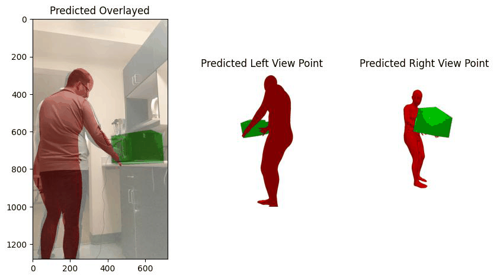

# Articulated 3D Human-Object Interactions from RGB Videos: An Empirical Analysis of Approaches and Challenges [3DV 2022] 
[Sanjay Haresh](https://www.sanjayharesh.com), [Xiaohao Sun](), [Hanxiao Jiang](https://jianghanxiao.github.io/), [Angel Xuan Chang](http://angelxuanchang.github.io/), [Manolis Savva](https://msavva.github.io/)

[Paper](https://arxiv.org/pdf/2209.05612.pdf)&nbsp; [Website](https://3dlg-hcvc.github.io/3dhoi/)



## Content
- [Setup](#Setup)
- [Dataset](#Dataset)
- [Optimization](#Running-CubeOPT-on-D3D-HOI-data)
- [Evaluation](#Evaluation)
- [Visualization](#Visualization)

## Setup
The implementation has been tested on Ubuntu 20.04, with PyTorch 1.10.1, CUDA 11.3 and CUDNN 8.2.1.

* Clone the repository
```sh
git clone --recursive https://github.com/3dlg-hcvc/3dhoi.git
```
* Setup conda environment
```sh
conda env create -f environment.yml
conda activate 3dhoi
# install pytorch3d
conda install -c fvcore -c iopath -c conda-forge fvcore iopath
conda install -c bottler nvidiacub
pip install "git+https://github.com/facebookresearch/pytorch3d.git@v0.6.1"

# install mesh intersection loss package
# refer to this issue if you encounter any problems while installing https://github.com/vchoutas/torch-mesh-isect/issues/23
git clone https://github.com/vchoutas/torch-mesh-isect.git
cd torch-mesh-isect/
git clone https://github.com/NVIDIA/cuda-samples.git
export CUDA_SAMPLES_INC=$(pwd)/cuda-samples/Common/
pip install -r requirements.txt 
python setup.py install
cd ../
```

## Dataset
1. Download D3D-HOI dataset [here](https://github.com/facebookresearch/d3d-hoi#d3d-hoi-video-dataset) and place it in the data folder.
2. Download the processed cads used in D3D-HOI from [here](https://drive.google.com/file/d/1UOB1Qj5isQLjnBzJW1QE9H7RpXEXZhvo/view?usp=sharing) and extract it in the data folder.
3. Run the preprocess script to generate Meshes and Motion Estimation ground truths.
```sh
cd preprocess/
python generate_gts.py --data_folder ../data/d3dhoi_video_data --cad_folder ../data/processed_cads --videos_file ../data/3dhoi_videos.txt
```
4. To visualize the processed CADs and humans,
```sh
cd preprocess/
python visualize_data.py --data_path /path/to/video/ \
                         --cad_path /path/to/processed_cads/category/ \
                         --save_images_path /path/to/output/
```

## Running CubeOPT on D3D-HOI data

To run CubeOPT on a given videos in D3D-HOI: 
```
python main.py --data_path /path/to/video/ \
               --out_path /results/video/ \
               --seed 0 \
               --iterations 500 \
               --step 2 \
               --desc "running cubeopt on video"
``` 

To run CubeOPT on all the videos in D3D-HOI: 
```
bash scripts/run_3dhoi.sh data/3dhoi_videos.txt
``` 

`main.py` takes in the following parameters:
1. `data_path` : path to dataset
2. `out_path` : output path for framewise mesh and motion predictions
3. `lr` : learning rate for the optimization
4. `iterations` : number of iterations to run optimization
5. `seed` : seed for prngs
6. `step` : step to sample frames while loading
7. `no-hoi` : set the flag to run without hoi losses
8. `no-depth` : set the flag to run without depth loss
9. `no-contact` : set the flag to run without contact loss
10. `desc` : description of the experiment

The file `model.py` defines the CubeOPT model and the error terms used for optimization. 

The optimized results are stored in `/results/video` folder. The folder should contain predicted object models (`*_obj.obj`), smpl models (`*_smpl.obj`) for human pose estimates and motion estimates (`axis_origin_pred.json`).

## Evaluation

To evaluate the reconstruction and pose estimates,
```
python evals/eval_reconstruction_avg.py --videos_file data/3dhoi_videos.txt \
                                        --gt_dir /path/to/dataset/ \
                                        --pred_dir /path/to/results/ \
                                        --method method_name \
                                        --out_dir /path/to/results/errors
```

To evaluate the motion estimates,
```
python evals/eval_motion.py --videos_file data/3dhoi_videos.txt \
                                        --gt_dir /path/to/dataset/ \
                                        --pred_dir /path/to/results/ \
                                        --method method_name \
                                        --out_dir /path/to/results/errors
```

To collate all the errors and generate accuracy estimates,
```
python evals/compile_inter.py --result_dir /path/to/results/errors

python evals/eval_accuracy.py --result_dir /path/to/results/errors
```

Here's an example output of running above scripts for CubeOPT,
```
python evals/compile_inter.py --result_dir cubeopt/errors/
There are totally 239 videos
CD-Obj : 1.57 +- 0.11
CD-Part : 0.66 +- 0.06
Rotation : 38.95 +- 1.73
Translation : 2.37 +- 0.09
Scale : 0.28 +- 0.01
Origin : 0.71 +- 0.03
Axis : 27.42 +- 2.06
Direction : 94.09 +- 4.53
State : 126.60 +- 5.00
0.2938404083251953 seconds

python evals/eval_accuracy.py --result_dir sim_template_human/errors/
There are totally 239 videos
Doing :  [10.0, 0.5, 0.3]
CD-Obj : 35.5
CD-Part : 65.5
Reconstruction : 29.5
Rotation : 19.2
Translation : 1.7
Scale : 62.9
Pose : 1.0
Origin : 43.9
OA : 20.1
OAD : 16.3
OADS : 10.0
RP : 1.0
RPOA : 0.7
RPOADS : 0.5
0.3064093589782715 seconds
```

To get the reconstruction and pose estimates from other baselines including [3DADN](https://github.com/JasonQSY/Articulation3D), [D3DHOI](https://github.com/facebookresearch/d3d-hoi), [LASR](https://github.com/google/lasr), [ViSER](https://github.com/gengshan-y/viser-release) and [Ditto](https://github.com/UT-Austin-RPL/Ditto) refer to the [baselines](baselines/) folder.

## Visualization

To visualize the optimized results,

```sh
cd visualization/
python visualize_optimized.py --data_path /path/to/video/ \
                              --results_path /path/to/outputs/ \
                              --out_path /path/to/save/visualization \
                              --skip_interactive
```

The above command should generate a gif at the given path as shown below,



## References

The code is based on [D3D-HOI](https://github.com/facebookresearch/d3d-hoi) and the reconstruction evaluation code is based on [LASR](https://github.com/google/lasr).

## Citation

If you find this code useful, please consider citing:
```bibtex
@inproceedings{haresh2022articulated,
    title={Articulated 3D Human-Object Interactions from RGB Videos: An Empirical Analysis of Approaches and Challenges}, 
    author={Haresh, Sanjay 
            and Sun, Xiaohao 
            and Jiang, Hanxiao 
            and Chang, Angel X 
            and Savva, Manolis},
    booktitle={2022 International Conference on 3D Vision (3DV)},
    year={2022},
    organization={IEEE}
}
```
